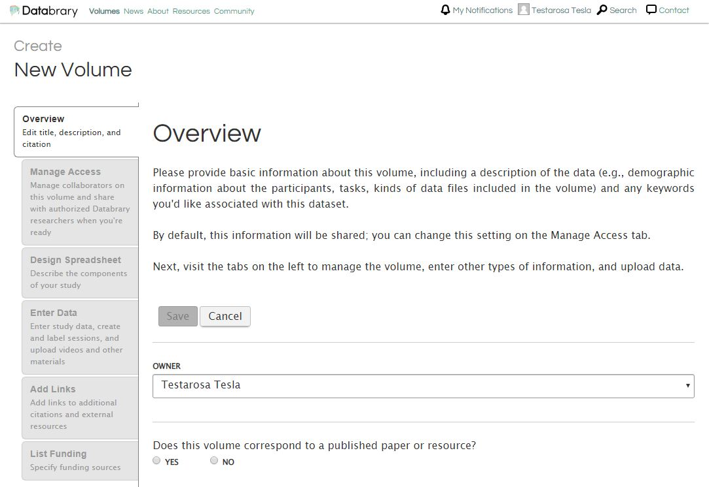

# How to create a new volume on Databrary.

Log in to your account by clicking the pink 'Login' button in the middle of databrary.org.

Click on 'Your Profile'

Click on 'Create Volume' to the right of 'Data Owner Volumes'

There are multiple tabs on the left side of the screen that need to be completed to set up a new volume. These tabs need to be completed in order.

Create the Volume Overview by choosing if the volume is related to a published resource and answering the related questions (Title, Description, Internal Short Name and additional citation information if necessary). When all items are entered, select 'Save'

Next, go to the Manage Access Tab. In this tab, you can choose volume sharing options and add collaborators (faculty, staff, students) that already have an account on Databrary. Click 'Save' when done.

Please note: Only an Authorized Investigator can 'Share Entire Volume'

Now, go to the 'Design Spreadsheet' Tab. Choose all the categories and sub-categories you would like to include in your spreadsheet.

Next, choose the 'Enter Data' tab. You may do this by uploading an appropriately formatted .csv file or entering these data individually. To do this individually, click in the 'ID' box to add a participant. After the line in the spreadsheet is created for a participant, related files may then be added.

Next, choose the 'Add Links' tab. Here you will want to add links to any outside resources related to this dataset.

Finally, go to the 'List Funding' Tab and enter any funding sources related to this volume.

