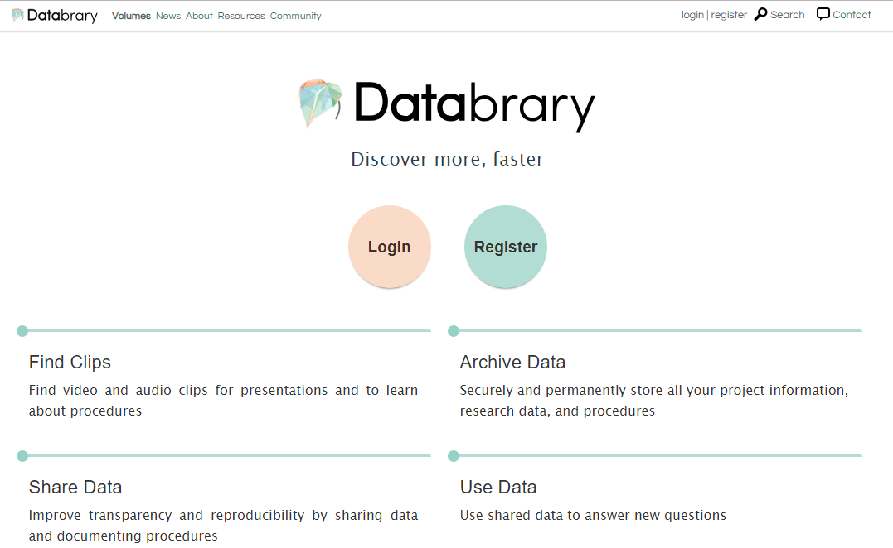
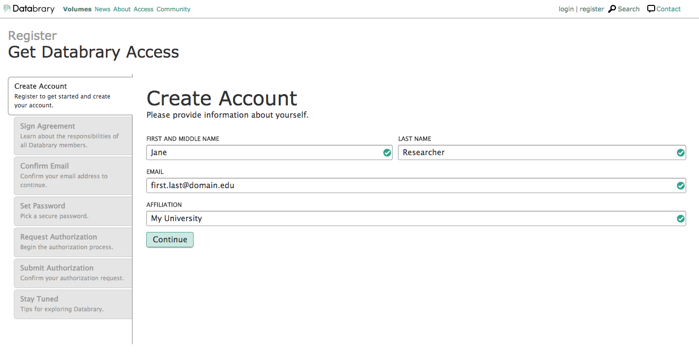
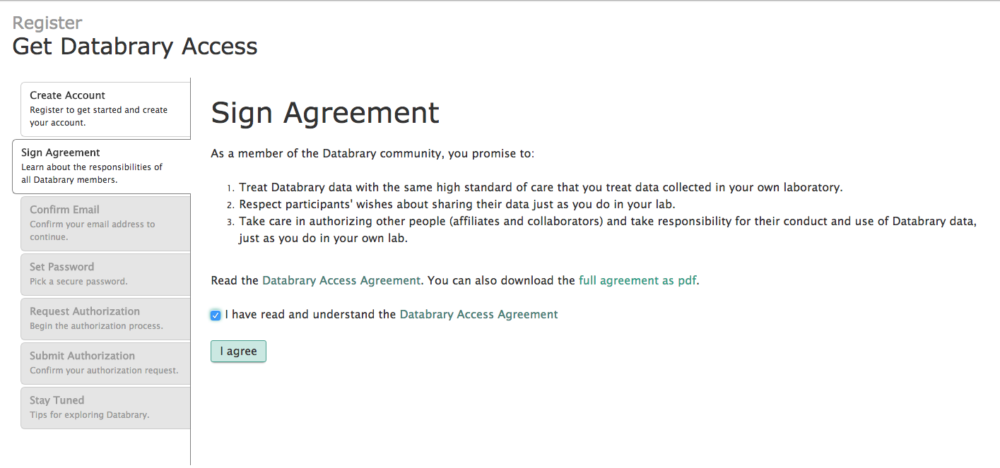
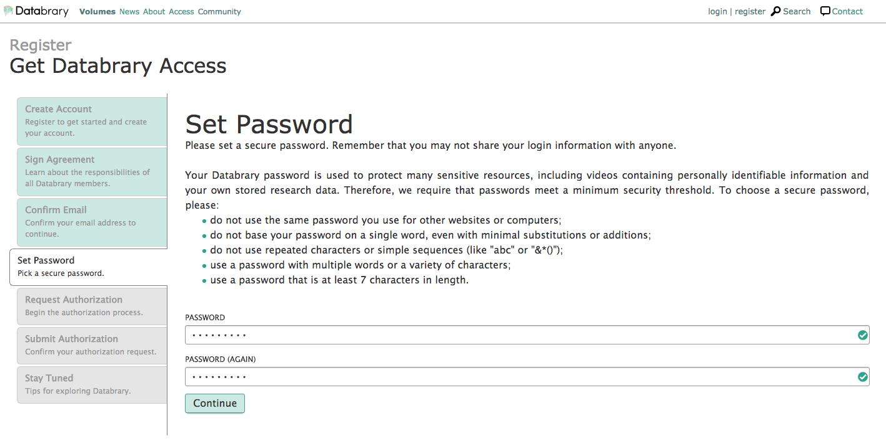

# How to Register for Databrary Access  

To start the authorization process on Databrary, please fill out this [form](https://nyu.databrary.org/user/register?page=create) or click "register" on the top right of the menu bar on databrary.org.  

  
Fill out the Create Account form with your full name, valid institutional email address, and the name of your research institution.

   
  
Read the access agreement and agree to the access terms.  

  
  
Go to your email box, locate the auto-generated email from Databrary, and confirm your email. If you don't receive the email within a few minutes, check your spam folder.  

   
  
Choose a password.  

     
  
Decide if you are entitled to Authorized Investigator status, or are requesting affiliate status from your PI (See info section, below, for more information on who qualifies as an Authorized Investigator.)

To register as an Authorized Investigator:

Select the Authorized Investigator radio button and search for your institution.
This will auto-generate a notification to the Databrary team with a Databrary Access Agreement, which needs to be signed both by you and your contracts office.
Databrary's authorization team will be in touch within 24-48 hours to help you through the process.
There is more general information about becoming an Authorized Investigator on Databrary here and here.

To register as an Affiliate:

Select the Affiliate radio button and search for your sponsoring PI's name. (Note: If your PI does not yet have an account on Databrary, he or she will have to follow the instructions above to become an Authorized Investigator.)
Your PI will receive a notification that you have applied for access, and can approve you. Alternately, your PI can go to their profile, and add you as an affiliate manually.

  