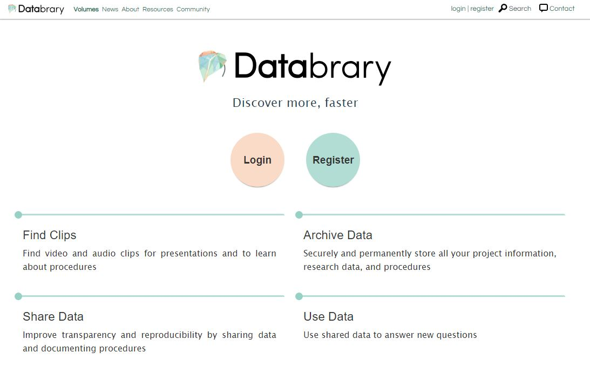
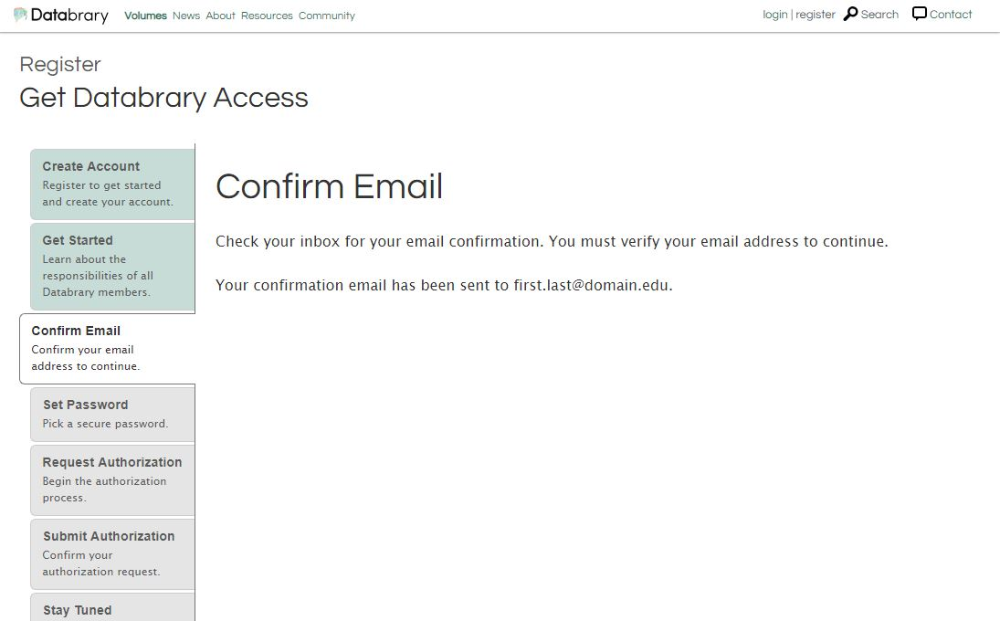

# How to Register for Databrary Access  

To start the authorization process on Databrary, please fill out this [form](https://nyu.databrary.org/user/register?page=create) or click "register" on the top right of the menu bar on databrary.org.  

  
Fill out the Create Account form with your full name, valid institutional email address, and the name of your research institution.

 
  
Read the access agreement and agree to the access terms. 

Go to your email box, locate the auto-generated email from Databrary, and confirm your email. If you don't receive the email within a few minutes, check your spam folder.  

Please choose a password.  

Decide if you are entitled to Authorized Investigator status, or are requesting affiliate status from your Supervisor or Research Sponsor (See info section, below, for more information on who qualifies as an Authorized Investigator.)

To register as an Authorized Investigator:

1. Select the Authorized Investigator radio button and search for your institution. If your institution is not found in the drop down box, please select 'Other' and provide more information on the next screen.
2. This will auto-generate a notification to the Databrary team with a Databrary Access Agreement, which needs to be signed both by you and your contracts office.
3. Databrary's authorization team will be in touch within 24-48 business hours to help you through the process.
4. There is more general information about becoming an Authorized Investigator on Databrary [here](https://databrary.org/about/agreement.html) and [here](https://databrary.org/about/policies.html).

To register as an Affiliate:

1. Select the Affiliate radio button and search for your Supervisor or Research Sponsor's name. (Note: If your Supervisor or Research Sponsor does not yet have an account on Databrary, he or she will have to follow the instructions above to become an Authorized Investigator.)
2. Your Supervisor or Research Sponsor Investigator will receive a notification that you have applied for access, and can approve you. Alternately, your PI can go to their profile, and add you as an affiliate manually.

**Should I register as an Authorized Investigator or an affiliate?**

To be an Authorized Investigator on Databrary you must have:

1. PI/Principal Investigator status or be eligible to conduct independent research at your institution;
2. All current research ethics training required by your institution; and
3. An ethics or institutional review board that reviews and approves research involving human subjects.  

If you are a post-doc, a doctoral student, or a lab staff member, you will need to request access from your supervisor or PI as an affiliate. Your Supervisor or Research Sponsor must register as an Authorized Investigator, if they have not already done so.  
